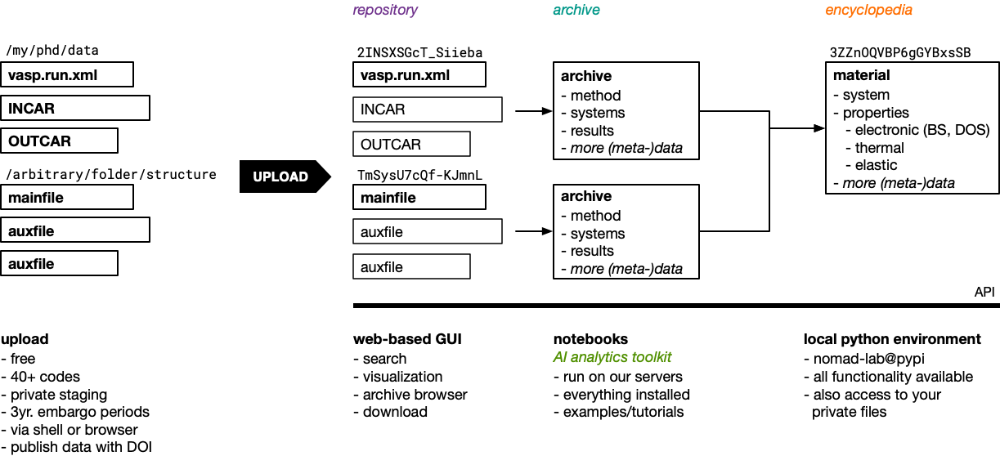
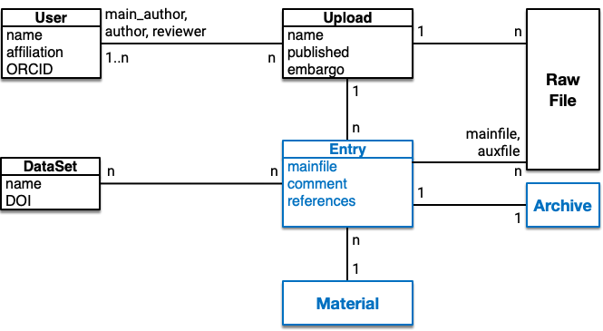
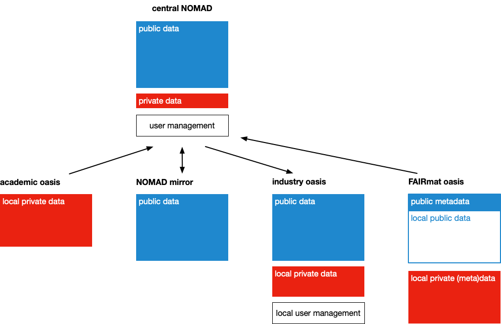
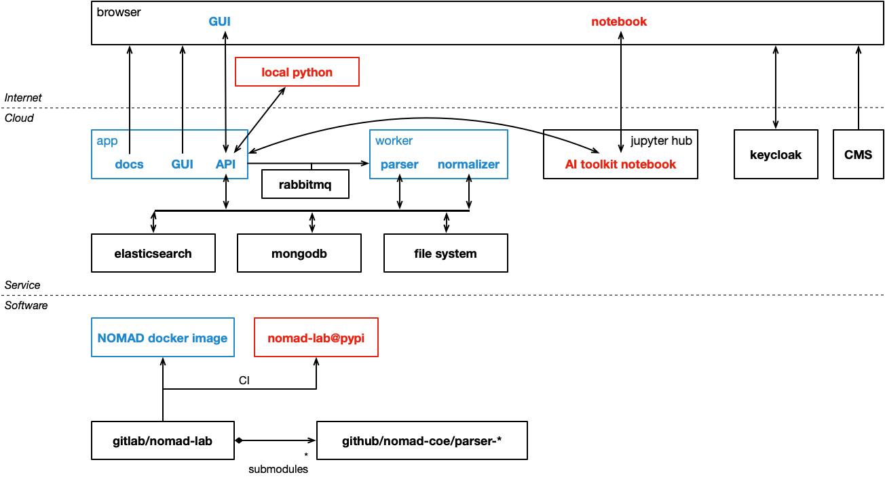
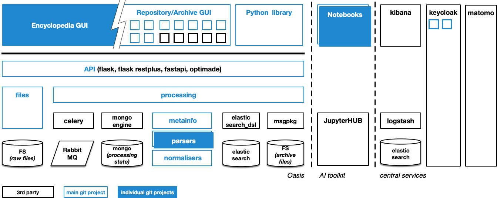

# NOMAD makes materials science data FAIR

The **NOvel Materials Discovery (NOMAD)** is a data management platform for materials
science data. Here, NOMAD is a [web-application and database](https://nomad-lab.eu/prod/v1/gui/search)
that allows to centrally publish data. But you can also use the NOMAD software to build your
own local [NOMAD Oasis](../oasis/).

  

    
<i>More than 12 million of simulations from over 400 authors world-wide</i>

    <ul>
      <li>Free publication and sharing data of data</li>
      <li>Manage research data though its whole life-cycle</li>
      <li>Extracts <b>rich metadata</b> from data automatically</li>
      <li>All data in <b>raw</b> and <b>machine processable</b> form</li>
      <li>Use integrated tools to <b>explore</b>, <b>visualize</b>, and <b>analyze</b></li>
    </ul>
  

  

    
  

## History of NOMAD
NOMAD was founded 2014 as a repository for sharing electronic structure code files.

The first [NOMAD-coe](http://nomad-coe.eu) project (2016-2019) extended the raw-file *repository*.
Parsers were developed to automatically extract rich metadata and transform all
data into a common machine processable *archive*. The *encyclopedia* allowed to explore
and visualize data from a materials and properties perspective. The *ai toolkit* was
established to run analysis notebooks directly on NOMAD servers.

The current official installation of [NOMAD (v0.x)](https://nomad-lab.eu/prod/rae) is the
result of a consolidation process that integrated the NOMAD-CoE services *repository*,
*archive*, *encyclopedia*, and *ai toolkit*. Here, we also introduced the NOMAD Oasis and
allowed to the local use of NOMAD.

Since then, NOMAD is developed by [nomad-lab.eu](https://nomad-lab.eu) and
[fair-di e.V.](https://fair-di.eu) as a general platform for managing materials science data.
Upcoming NOMAD version including [this NOMAD (v1)](https://nomad-lab.eu/prod/v1/gui) extend
NOMAD towards material science synthesis, experiments, and computational material science
at different scales.

## How does NOMAD work?

### Managing data based on automatically extract rich metadata

NOMAD is based on a *bottom-up* approach. Instead of only managing data of a specific
predefined format, we use parsers and processing to support an extendable variety of
data formats. Uploaded *raw* files are analysed and files with a recognized format are parsed.
Parsers are small programs that transform data from the recognized *mainfiles* into a common machine
processable version that we call *archive*. The information in the common archive representation
drives everything else. It is the based for our search interface, the representation of materials
and their properties, as well as all analytics.

### A common hierarchical machine processable format for all data

The *archive* is a hierarchical data format with a strict schema.
All the information is organized into logical nested *sections*.
Each *sections* comprised a set of *quantities* on a common subject.
All *sections* and *quantities* are backed by a formal schema that defines names, descriptions, types, shapes, and units.
We sometimes call this data *archive* and the schema *metainfo*.

### NOMAD datamodel: *uploads*, *entries*, *files*, *datasets*

Uploaded *raw* files are managed in *uploads*.
Users can create *uploads* and use them like projects.
You can share them with other users, incrementally add and modify data in them, publish (incl. embargo) them, or transfer them between NOMAD installations.
As long as an *upload* is not published, you can continue to provide files, delete the upload again, or test how NOMAD is processing your files.
Once an upload is published, it becomes immutable.

An *upload* can contain an arbitrary directory structure of *raw* files.
For each recognized *mainfile*, NOMAD creates an entry.
An *upload* therefore contains a list of *entries*.
Each *entry* is associated with its *mainfile*, an *archive*, and all other *auxiliary* files in the same directory.
*Entries* are automatically aggregated into *materials* based on the extract materials metadata.
*Entries* (of many uploads) can be manually curated into *datasets*. You can get a DOI for *datasets*.

### Using NOMAD software locally (the Oasis)

The software that runs NOMAD is Open-Source and can be used independently of the NOMAD
*central installation* that is run at [http://nomad-lab.eu](http://nomad-lab.eu).
We call any NOMAD installation that is not the *central* one a NOMAD Oasis.

There are several use-cases how the NOMAD software could be used. Of course other
uses and hybrids are imaginable:

- Academia: Use the Oasis for local management of unpublished research data
- Mirror: Use the Oasis as a mirror that hosts a copy of all published NOMAD data
- Industry: Use the Oasis to manage private data and use published data fully internally with
to comply with strict privacy policies
- FAIRmat: Use Oasis to form a network of repositories to build a federated data infrastructure
for materials science.
This what we do in the [FAIRmat project](https://www.fair-di.eu/fairmat/consortium).

## Architecture

### A containerized cloud enabled architecture

NOMAD is a modern web-application that requires a lot of services to run. Some are
NOMAD specific, others are 3rd party products. While all services can be traditionally
installed and run on a single sever, NOMAD advocates the use of containers and operating
NOMAD in a cloud environment.

NOMAD comprises two main services, its *app* and the *worker*. The *app* services
our API, graphical user interface, and documentation. It is the outward facing part of
NOMAD. The worker runs all the processing (parsing, normalization). Their separation allows
to scale the system for various use-cases.

Other services are:
- rabbitmq: a task queue that we use to distribute tasks for the *worker* containers
- mongodb: a no-sql database used to maintain processing state and user-metadata
- elasticsearch: a no-sql database and search engine that drives our search
- a regular file system to maintain all the files (*raw* and *archive*)
- jupyterhub: run ai toolkit notebooks
- keycloak: our SSO user management system (can be used by all Oasises)
- a content management system to provide other web-page content (not part of the Oasis)

All NOMAD software is bundled a single NOMAD docker image and a Python
([nomad-lab on pypi](https://pypi.org/project/nomad-lab/)) package. The NOMAD docker
image can be downloaded from our public registry.
NOMAD software is organized in multiple git repositories. We use continuous integration
to constantly produce a latest version of docker image and Python package.

### NOMAD uses a modern and rich stack frameworks, systems, and libraries

Besides various scientific computing, machine learning, and computational material
science libraries (e.g. numpy, skikitlearn, tensorflow, ase, spglib, matid, and many more),
Nomad uses a set of freely available technologies that already solve most
of its processing, storage, availability, and scaling goals. The following is a non
comprehensive overview of used languages, libraries, frameworks, and services.

#### Python 3

The *backend* of nomad is written in Python. This includes all parsers, normalizers,
and other data processing. We only use Python 3 and there is no compatibility with
Python 2. Code is formatted close to [pep8](https://www.python.org/dev/peps/pep-0008/),
critical parts use [pep484](https://www.python.org/dev/peps/pep-0484/) type-hints.
[Pycodestyle](https://pypi.org/project/pycodestyle/),
[pylint](https://www.pylint.org/), and
[mypy](http://mypy-lang.org/) (static type checker) are used to ensure quality.
Tests are written with [pytest](https://docs.pytest.org/en/latest/contents.html).
Logging is done with [structlog](https://www.structlog.org/en/stable/) and *logstash* (see
Elasticstack below). Documentation is driven by [Sphinx](http://www.sphinx-doc.org/en/master/).

#### celery

[Celery](http://celeryproject.org) (+ [rabbitmq](https://www.rabbitmq.com/))
is a popular combination for realizing long running tasks in internet applications.
We use it to drive the processing of uploaded files.
It allows us to transparently distribute processing load while keeping processing state
available to inform the user.

#### elastic search

[Elasticsearch](https://www.elastic.co/webinars/getting-started-elasticsearch)
is used to store repository data (not the raw files).
Elasticsearch allows for flexible scalable search and analytics.

#### mongodb

[Mongodb](https://docs.mongodb.com/) is used to store and track the state of the
processing of uploaded files and therein contained calculations. We use
[mongoengine](http://docs.mongoengine.org/) to program with mongodb.

#### Keycloak

[Keycloak](https://www.keycloak.org/) is used for user management. It manages users and
provide functions for registering, password forget, editing user accounts, and single
sign on of fairdi@nomad and other related services.

#### FastAPI

The ReSTful API is build with the [FastAPI](https://fastapi.tiangolo.com/)
framework. This allows us to automatically derive a [OpenAPI](https://swagger.io/specification/) description
of the nomad API.
Fruthermore, you can browse and use the API via [OpenAPI dashboard](https://swagger.io/tools/swagger-ui/).

#### Elasticstack

The [elastic stack](https://www.elastic.co/guide/index.html)
(previously *ELK* stack) is a central logging, metrics, and monitoring
solution that collects data within the cluster and provides a flexible analytics frontend
for said data.

#### Javascript, React, Material-UI

The frontend (GUI) of **nomad@FAIRDI** build on top of the
[React](https://reactjs.org/docs/getting-started.html) component framework.
This allows us to build the GUI as a set of re-usable components to
achieve a coherent representations for all aspects of nomad, while keeping development
efforts manageable. React uses [JSX](https://reactjs.org/docs/introducing-jsx.html)
(a ES6 variety) that allows to mix HTML with Javascript code.
The component library [Material-UI](https://material-ui.com/)
(based on Google's popular material design framework) provides a consistent look-and-feel.

#### docker

To run a **nomad@FAIRDI** instance, many services have to be orchestrated:
the nomad app, nomad worker, mongodb, Elasticsearch, Keycloak, RabbitMQ,
Elasticstack (logging), the nomad GUI, and a reverse proxy to keep everything together.
Further services might be needed (e.g. JypiterHUB), when nomad grows.
The container platform [Docker](https://docs.docker.com/) allows us to provide all services
as pre-build images that can be run flexibly on all types of platforms, networks,
and storage solutions. [Docker-compose](https://docs.docker.com/compose/) allows us to
provide configuration to run the whole nomad stack on a single server node.

#### kubernetes + helm

To run and scale nomad on a cluster, you can use [kubernetes](https://kubernetes.io/docs/home/)
to orchestrated the  necessary containers. We provide a [helm](https://docs.helm.sh/)
chart with all necessary service and deployment descriptors that allow you to setup and
update nomad with few commands.

#### GitLab

Nomad as a software project is managed via [GitLab](https://docs.gitlab.com/).
The **nomad@FAIRDI** project is hosted [here](https://gitlab.mpcdf.mpg.de/nomad-lab/nomad-FAIR).
GitLab is used to manage versions, different branches of development, tasks and issues,
as a [registry for Docker images](https://docs.gitlab.com/ee/user/project/container_registry.html),
and [CI/CD platform](https://docs.gitlab.com/ee/ci/).
