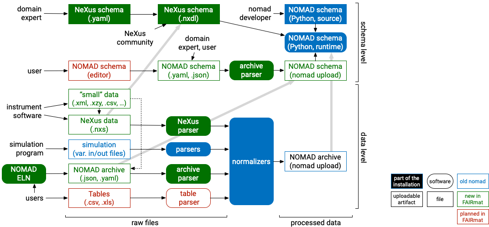

# An Introduction to Schemas and Structured Data in NOMAD

NOMAD stores all processed data in a *well defined*, *structured*, and *machine readable*
format. Well defined means that each element is supported by a formal definition that provides
a name, description, location, shape, type, and possible unit for that data. It has a
hierarchical structure that logically organizes data in sections and subsections and allows
cross-references between pieces of data. Formal definitions and corresponding
data structures enable the machine processing of NOMAD data.

## The Metainfo is the schema for Archive data.
The Archive stores descriptive and structured information about materials-science
data. Each entry in NOMAD is associated with one Archive that contains all the processed
information of that entry. What information can possibly exist in an archive, how this
information is structured, and how this information is to be interpreted is governed
by the Metainfo.

## On schemas and definitions
Each piece of Archive data has a formal definition in the Metainfo. These definitions
provide data types with names, descriptions, categories, and further information that
applies to all incarnations of a certain data type.

Consider a simulation `Run`. Each
simulation run in NOMAD is characterized by a *section*, that is called *run*. It can contain
*calculation* results, simulated *systems*, applied *methods*, the used *program*, etc.
What constitutes a simulation run is *defined* in the metainfo with a *section definition*.
All other elements in the Archive (e.g. *calculation*, *system*, ...) have similar definitions.

Definitions follow a formal model. Depending on the definition type, each definition
has to provide certain information: *name*, *description*, *shape*, *units*, *type*, etc.

## Types of definitions

- *Sections* are the building block for hierarchical data. A section can contain other
  sections (via *subsections*) and data (via *quantities*).
- *Subsections* define a containment relationship between sections.
- *Quantities* define a piece of data in a section.
- *References* are special quantities that allow to define references from a section to
  another section or quantity.
- *Categories* allow to categorize definitions.
- *Packages* are used to organize definitions.

## Interfaces
The Archive format and Metainfo schema is abstract and not not bound to any
specific storage format. Archive and Metainfo can be represented in various ways.
For example, NOMAD internally stores archives in a binary format, but serves them via
API in json. Users can upload archive files (as `.archive.json` or `.archive.yaml`) files.
Metainfo schema can be programmed with Python classes, but can also be uploaded as
archive files (the Metainfo itself is just a specific Archive schema). The following
chart provides a sense of various ways that data can be entered into NOMAD:

There are various interface to provide or retrieve Archive data and Metainfo schemas.
The following documentation sections will explain a few of them.
